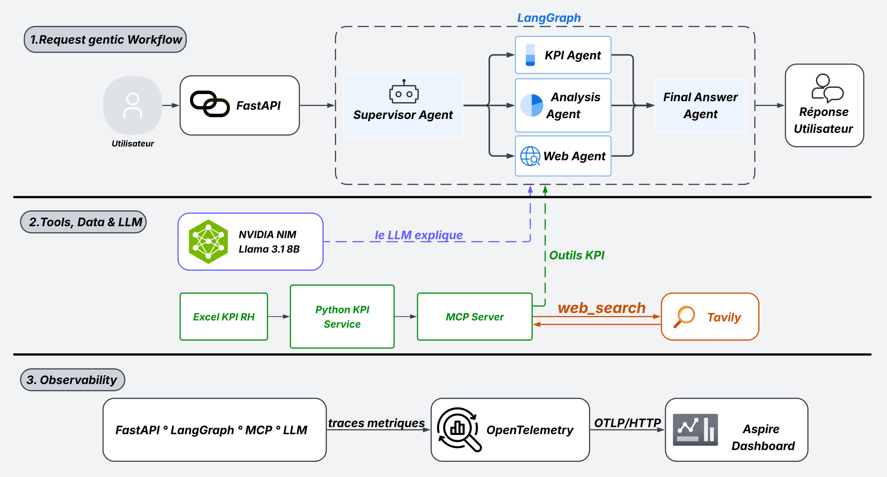

# NSI HR Mini Système Agentique

Assistant RH/Data pour interroger, analyser et comparer les KPI de recrutement du T3 2024 à partir d'un fichier Excel.

L'objectif du projet est simple : transformer un reporting Excel statique en API et assistant agentique capable de répondre à des questions métier en langage naturel, tout en gardant les calculs KPI déterministes et vérifiables.

## Idée centrale

   Python calcule. Le LLM explique.

- `backend/app/services/kpi_service.py` lit l'Excel et calcule les KPI.
- `backend/app/mcp_server/server.py` expose ces KPI comme outils MCP.
- `backend/app/agents/graph.py` orchestre le workflow LangGraph.
- `backend/app/services/llm_service.py` utilise NVIDIA NIM pour router, reformuler et analyser.
- `backend/app/prompts.py` contient les prompts du routeur, du KPI agent, de l'analyse agent et du web agent.

## Ce que le système sait faire

- Répondre aux questions factuelles sur les KPI globaux.
- Répondre aux questions par recruteuse : Inès, Mariéme, Pauline, Samya.
- Comparer deux recruteuses.
- Produire une analyse métier du tunnel de recrutement.
- Comparer les KPI internes avec un contexte web via Tavily.
- Retourner la route choisie, la raison du routage, le chemin d'exécution et les sources.
- Exposer les traces/métriques via OpenTelemetry vers un collecteur OTLP local.

## Architecture



### Routes agentiques

| Route | Rôle | Exemples |
| --- | --- | --- |
| `kpi_agent` | Réponses factuelles et comparaisons internes | `Combien de candidats avons-nous contactés ?`, `Compare Inès et Pauline` |
| `analysis_agent` | Interprétation métier et recommandations | `Quels sont les points de friction ?`, `Que recommandes-tu ?` |
| `web_agent` | Comparaison avec le marché ou tendances externes | `Compare nos KPI avec les tendances du recrutement en France` |

## Installation

Depuis la racine du projet :

```bash
python3 -m venv .venv
source .venv/bin/activate
python -m pip install -r backend/requirements.txt
cp .env.example .env
```

Puis renseigner les clés dans `.env` :

```bash
NVIDIA_API_KEY=...
NVIDIA_MODEL=meta/llama-3.1-8b-instruct
TAVILY_API_KEY=...
```

Notes :

- `NVIDIA_API_KEY` est requis pour `/assistant/ask`.
- `TAVILY_API_KEY` est requis pour les vraies comparaisons web.
- Sans Tavily, le web agent dégrade proprement la réponse au lieu de casser tout le workflow.
- Le fichier Excel par défaut est lu depuis `data/Data Reporting KPI RH Q32024 (1).xlsx`.

## Lancer l'API

```bash
.venv/bin/python -m uvicorn backend.app.main:app --reload
```

Swagger :

```text
http://127.0.0.1:8000/docs
```

Health check :

```bash
curl -fsS http://127.0.0.1:8000/health
```

## Cockpit RH

Après avoir lancé FastAPI, ouvrir :

```text
http://127.0.0.1:8000/
```

Le cockpit présente les KPI du T3 2024, le tunnel de conversion, la comparaison des recruteuses et l'assistant agentique. Dans un même onglet ouvert, plusieurs questions et réponses restent visibles dans leur ordre d'envoi. Chaque question reste toutefois indépendante : seule la question courante est envoyée à l'API, sans historique ni mémoire conversationnelle.

Cette conversation est conservée uniquement en mémoire dans l'onglet courant. Elle n'est ni enregistrée ni partagée entre onglets ; actualiser ou fermer la page l'efface. Le bouton **Effacer** restaure aussi l'état initial. Si une demande échoue, les réponses précédentes restent visibles et **Réessayer** remplace l'erreur à la même position sans dupliquer la question.

Chaque réponse peut afficher l'agent sélectionné puis, dans une section repliée par défaut, ses sources et son Parcours d’exécution. Le champ de réponse optionnel `presentation` accepte quatre types de blocs validés : `metrics` (cartes KPI), `table` (tableau comparatif), `insight` (point d'attention) et `actions` (actions proposées). Un bloc inconnu ou invalide est ignoré ; si `presentation` est absent ou vide, la réponse texte `answer` reste l'affichage de référence.

Les quatre questions approuvées pour la démonstration sont :

1. `Donne-moi les 4 KPI clés du T3 2024.`
2. `Compare Inès et Pauline sur les mêmes indicateurs.`
3. `Où se situe la principale friction du parcours de recrutement ?`
4. `Compare nos KPI aux tendances du recrutement IA/Data en France.`

Pour une démonstration courte :

1. Montrer les quatre KPI du cockpit et les deux taux de conversion calculés depuis Excel.
2. Envoyer la première question pour faire apparaître les cartes KPI de l'Agent KPI.
3. Envoyer la deuxième sans effacer la première : montrer que les deux tours restent visibles, puis présenter le tableau comparatif des recruteuses.
4. Envoyer la troisième pour montrer l'analyse de la friction principale, en distinguant faits, hypothèses et recommandations.
5. Déplier **Sources et parcours agentique** sur une réponse afin de montrer la source KPI, le superviseur, l'agent spécialiste et les outils MCP ; laisser les autres sections repliées.
6. Provoquer uniquement dans un environnement de test une erreur contrôlée, constater que les réponses précédentes sont conservées, puis cliquer sur **Réessayer** pour remplacer la carte d'erreur sans ajouter un nouveau tour.
7. Si Tavily est configuré, envoyer la quatrième question pour montrer l'Agent Web et les sources externes ; sinon, expliquer la dégradation prévue sans lancer d'appel externe.

## API principale

### KPI globaux

```http
GET /kpis/summary
```

### Taux principaux

```http
GET /kpis/rates
```

### KPI par recruteuse

```http
GET /kpis/recruiters
```

### Assistant

```http
POST /assistant/ask
```

Exemple :

```bash
curl -X POST http://127.0.0.1:8000/assistant/ask \
  -H "Content-Type: application/json" \
  -d '{"question": "Compare Inès et Pauline"}'
```

La réponse contient notamment :

- `answer` : réponse finale
- `route` : agent sélectionné
- `route_reason` : justification du routage
- `agent_path` : chemin d'exécution
- `sources` : source KPI et sources web éventuelles
- `presentation` : blocs visuels optionnels validés ; le client conserve `answer` comme fallback si ce champ est absent ou vide

## Outils MCP

Le serveur MCP expose les outils suivants :

| Outil | Description |
| --- | --- |
| `get_hr_kpi_summary` | KPI globaux du T3 2024 |
| `get_hr_kpi_rates` | Taux principaux |
| `get_kpis_by_recruiter` | KPI par recruteuse |
| `web_search` | Recherche web via Tavily |

Le client MCP lance le serveur en sous-processus avec le bon `PYTHONPATH`, donc les agents peuvent appeler les outils sans serveur MCP séparé à démarrer à la main.

## Tests automatiques

Les tests `pytest` sont déterministes. Ils ne doivent pas appeler NVIDIA, Tavily, ni une API FastAPI déjà lancée.

```bash
.venv/bin/python -m pytest -q
node --test frontend/tests/*.test.mjs
```

Ils couvrent :

- les KPI globaux calculés depuis l'Excel
- les KPI par recruteuse
- les erreurs de données KPI
- la forme du state LangGraph
- le fallback web quand Tavily est indisponible
- les réponses API via `TestClient`
- le parsing JSON du routeur LLM avec de fausses complétions
- le rendu, l'accessibilité et les interactions du cockpit

## Scripts manuels de démo

Ces scripts ne sont pas des tests automatisés. Ils servent à vérifier le système en conditions de démo ou de debug.

Vérifier les outils MCP :

```bash
.venv/bin/python backend/scripts/manual_mcp_check.py
```

Évaluer les questions business contre l'API déjà lancée :

```bash
.venv/bin/python backend/scripts/evaluate_assistant.py --show-answers
```

Sans afficher les réponses complètes :

```bash
.venv/bin/python backend/scripts/evaluate_assistant.py
```

## Observabilité

Le projet configure OpenTelemetry pour :

- les traces FastAPI
- les appels agents
- les appels LLM
- les appels MCP
- les métriques de requêtes assistant

Les exports OTLP HTTP pointent vers :

```text
http://localhost:4318/v1/traces
http://localhost:4318/v1/metrics
```

Pour désactiver la télémétrie, utile en test :

```bash
NSI_TELEMETRY_DISABLED=1 .venv/bin/python -m pytest -q
```

Note : `/health` est exclu des traces FastAPI. Pour vérifier la télémétrie, utiliser plutôt `/kpis/summary` ou `/assistant/ask`.

## Structure du projet

```text
backend/
  app/
    agents/            workflow LangGraph
    mcp_server/        outils MCP et client MCP
    observability/     OpenTelemetry et logs
    services/          lecture Excel, KPI et LLM NVIDIA
    main.py            API FastAPI
    prompts.py         prompts des agents
  scripts/             vérifications manuelles
  tests/               tests Python
  requirements.txt
frontend/
  js/                  logique du cockpit et de l'assistant
  tests/               tests JavaScript
  index.html
  styles.css
docs/
  NSI_France_Agentic_Workflow.svg
```

## Limites actuelles

- Une seule période : T3 2024.
- Une seule source Excel.
- Pas d'authentification.
- Pas de base de données.
- Les réponses assistant dépendent de NVIDIA NIM.
- Les comparaisons web dépendent de Tavily.

## Commandes utiles

```bash
# Tests déterministes
.venv/bin/python -m pytest -q
node --test frontend/tests/*.test.mjs

# API locale
.venv/bin/python -m uvicorn backend.app.main:app --reload

# Vérification MCP
.venv/bin/python backend/scripts/manual_mcp_check.py

# Évaluation business live
.venv/bin/python backend/scripts/evaluate_assistant.py --show-answers
```

## Démo rapide via l'API

1. Lancer l'API.
2. Ouvrir Swagger sur `http://127.0.0.1:8000/docs`.
3. Tester `/kpis/summary`.
4. Tester `/assistant/ask` avec les quatre questions approuvées :

```text
Donne-moi les 4 KPI clés du T3 2024.
Compare Inès et Pauline sur les mêmes indicateurs.
Où se situe la principale friction du parcours de recrutement ?
Compare nos KPI aux tendances du recrutement IA/Data en France.
```

5. Montrer `route`, `route_reason`, `agent_path` et `sources`.
